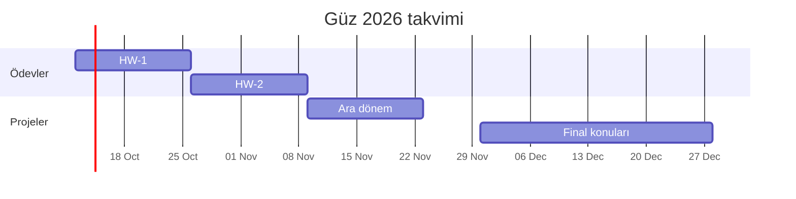

# UUM523E — Ders ve Proje Planı

[← README](README.md)

## 1. Ders içeriği

**UUM523E Advanced Flight Dynamics** · Dr. Şükrü Akif Ertürk · 3 kredi / 7.5 AKTS · MATLAB/Simulink zorunlu

| Hafta | Konu |
|---|---|
| 1 | Koordinat sistemleri ve eksen dönüşümleri |
| 2 | Hareket denklemleri ve statik kararlılık |
| 3 | 6 serbestlik dereceli uçak dinamiği modelleme ve benzetimi |
| 4 | Uçak trim problemi |
| 5 | Hareket denklemlerinin doğrusallaştırılması |
| 6 | Boylamsal ve yanal-yönsel dinamikler |
| 7 | Uçuş ve kullanım nitelikleri |
| 8 | **Ara dönem proje sunumları** |
| 9 | İleri konu: Pilotlu uçaklarda uçuş niteliği standartları ve regülasyonlar |
| 10 | İleri konu: Yüksek hücum açısında uçuş |
| 11 | İleri konu: Modelleme belirsizlikleri |
| 12 | İleri konu: Artık eyleyicili uçakların modellenmesi ve benzetimi |
| 13 | İleri konu: Kütle eyleyicili uçakların modellenmesi ve benzetimi |

**Not dağılımı** (tamamı grup notu):

| HW-1 | HW-2 | Ara dönem projesi | Final projesi |
|:---:|:---:|:---:|:---:|
| 10 | 10 | 30 | 50 |

## 2. Yol planı

| Aşama | Tarih | Yapılacaklar | Durum |
|---|---|---|---|
| **0 · Hazırlık** | Ekim başı | • Başlangıç modelini anlamak • MATLAB'da çalıştırıp temel çıktıları görmek • Aerodinamik verinin bütünlüğünü kontrol etmek | 🟡 Devam ediyor |
| **HW-1** | 12 Eki → 26 Eki | • Modelin yapısını ve varsayımlarını açıklamak • Açık çevrim benzetimleri • Bağımsız bir referansla (Julia çözümü) sayısal karşılaştırma • Eksen, birim ve işaret kontrolleri | ⬜ |
| **HW-2** | 26 Eki → 9 Kas | • Kendi trim formülasyonumuz • Trimin residual, fiziksel sınır ve benzetimle doğrulanması • Doğrusallaştırma ve çapraz kontrol • Doğrusal ve doğrusal olmayan yanıtların karşılaştırılması | ⬜ |
| **Ara dönem** | → 23 Kas | • Statik kararlılık ile doğrusal model karşılaştırması • Beş dinamik mod: kısa periyot, fugoid, Hollanda yuvarlanması, yuvarlanma, spiral • Sunum ve rapor | ⬜ |
| **Final** | Hf. 9–13, sunum final haftası | • Konu seçimi • Seçilen ileri konunun uygulanması • Sunum ve rapor | ⬜ |

## 3. Final projesi

*Konu henüz belirlenmedi.*

## 4. Teslim beklentileri

Ders belgelerinden (katalog formu, *Course Mindset*, final proje yönergeleri) çıkanlar:

**Genel**
- Gruplar 4 kişilik; **3. haftada (12 Ekim)** kesinleşiyor ve dönem sonuna kadar aynı kalıyor.
- Her aşama grubun bir önceki çalışmasının üzerine kuruluyor; HW-1'deki model sonraki tüm aşamalarda kullanılıyor.

**Ödevler (HW-1, HW-2)**
- Her biri 10 puan, 4 kişilik grup ödevi.
- HW-1: F-16 modelleme ve benzetim (MATLAB/Simulink).
- HW-2: HW-1 modelinin trim edilmesi ve doğrusallaştırılması.
- Ayrıntılı ödev yönergeleri geldiğinde eklenecek.

**Ara dönem projesi** (proje 10 + sunum 10 + rapor 10)
- HW-1 ve HW-2 üzerine kurulur.
- Statik kararlılık sonuçları doğrusallaştırılmış modelle karşılaştırılır.
- Belirlenen trim koşullarında dinamik modlar incelenir.

**Final projesi** (proje 30 + sunum 10 + rapor 10)
- Beş ileri konudan biri seçilir; **bir konuyu en fazla 2 grup** alabilir.
- Teslimler:
  - **Teknik rapor:** formülasyon, varsayımlar, sayısal yöntem, doğrulama, sonuçlar, sınırlamalar, fiziksel yorum
  - **MATLAB/Simulink dosyaları:** tüm sonuçları üreten, belgelenmiş **tek bir üst seviye çalıştırma betiği**
  - **Sunum:** problem, yöntem, ana sonuçlar, sınırlamalar, mühendislik çıkarımları
  - **Yeniden üretilebilirlik:** rapordaki her figür ve tablo teslim edilen dosyalardan yeniden üretilebilmeli

**Tüm aşamalar için temel ilke**
> *“A solver convergence flag is not a validation.”* — Çözücünün “başarılı” demesi doğrulama sayılmaz. Sonuçlar fizik, kısıtlar, residual'lar, limit durumlar veya bağımsız bir model yanıtı ile kontrol edilmelidir.
