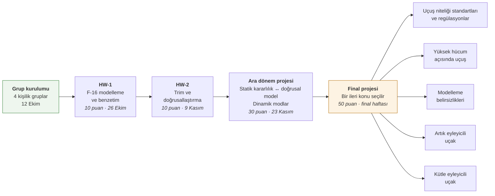

# UUM523E — Advanced Flight Dynamics

**İTÜ · Uçak ve Uzay Mühendisliği · Güz 2026**

Bu depo, UUM523E dersi boyunca yapılacak ödev ve projelerin çalışma alanıdır. Ders tek bir yol üzerine kuruludur: grup 3. haftada oluşur ve aynı grup HW-1, HW-2, ara dönem projesi ve final projesini birlikte yürütür. Her aşama, grubun bir önceki aşamadaki çalışmasının üzerine inşa edilir.

Ders içeriği, yol planı ve teslim beklentileri için: **[PROJECT.md](PROJECT.md)**

## Ders akışı

Final projesinde her grup beş konudan birini seçer; bir konuyu en fazla iki grup alabilir. Konumuz henüz belirlenmedi.

## Gereksinimler

- MATLAB **R2024b**
- Simulink ve Aerospace Blockset
- Simulink Control Design (trim ve doğrusallaştırma)
- Optimization Toolbox

## Başlangıç modeli hakkında notlar

Çalışmalara, Raktim Bhattacharya'nın açık kaynaklı doğrusal olmayan F-16 MATLAB/Simulink modeli (NASA TP-1538 aerodinamik verisi) ile başlanıyor. Bu model yalnızca bir başlangıç noktası; ders ilerledikçe değiştirilecek ve kendi çalışmalarımızla genişletilecek. İlk incelemede fark edilen ve doğrulanması gereken noktalar:

- Model pratikte **α ≤ 45°** aralığında çalışıyor; bu sınır aşılırsa hesap bozuluyor.
- `F16_2022a.mdl` ve `F16_2023a.mdl` ana modelin eski hâli; `F16.slx` kullanılmalı.
- Eyleyici dinamiği, yüzey sınırları ve motor dinamiği modelde yok.
- Eylemsizlik çarpımı (Ixz) işareti ders kitabındaki kurala göre ters olabilir.
- Hazır trim betiği (`TrimF16.m`) kontrol edilmeden kullanılmamalı.
- Model ağırlık merkezini %30 c̄ alıyor, TP-1538'deki nominal değer %35 c̄; bu seçim statik kararlılığı doğrudan etkiliyor.

## Kaynaklar

**Ders kaynakları**
- Yechout, T. R., *Introduction to Aircraft Flight Mechanics*, AIAA, 2003.
- Cook, M. V., *Flight Dynamics Principles: A Linear Systems Approach to Aircraft Stability and Control*, Butterworth-Heinemann, 2012.
- De Marco, A., Duke, E. L., Berndt, J. S., *A General Solution to the Aircraft Trim Problem*, AIAA 2007-6703, 2007.
- Stengel, R. F., *Flight Dynamics*, 2nd ed., Princeton University Press, 2022.
- Klein, V., Morelli, E. A., *Aircraft System Identification: Theory and Practice*, AIAA, 2006.
- Thomas, S., Kwatny, H. G., Chang, B. C., *Nonlinear Reconfiguration for Asymmetric Failures in a Six Degree-of-Freedom F-16*, ACC, 2004.

**Model ve veri**
- Nguyen vd., *Simulator Study of Stall/Post-Stall Characteristics of a Fighter Airplane With Relaxed Longitudinal Static Stability*, NASA TP-1538, 1979 — [NTRS](https://ntrs.nasa.gov/citations/19800005879)
- Stevens, B. L., Lewis, F. L., *Aircraft Control and Simulation*, Wiley, 1992.

## Atıf ve lisans

- **Başlangıç modeli:** © 2023 Raktim Bhattacharya, Texas A&M University — [MIT Lisansı](LICENSE). Orijinal dosyalardaki yazar bilgileri korunmuştur.
- **Ders kapsamındaki çalışmalar:** Emircan Sürücü, İTÜ — UUM523E, Güz 2026.
